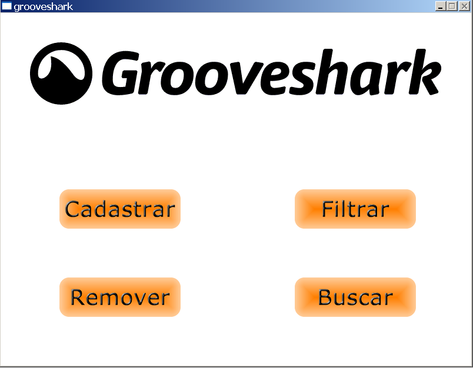

# Grooveshark



OVERVIEW
--------------------------------------------------
This is an implementation of a fictional grooveshark music project for the [Introduction to Computer Science II
][ICC2]. The purpose of this project was to develop an application with to practice sorting and searching algorithms along with File Management in C language. This project had a team with a team leader and each member had a purpose. For the Graphical User Interface, it was used the Allegro graphics library. This project was compiled using the Windows operating system. It was made in the course of Computer Science (ICMC - USP).

BUILD AND INSTALL
--------------------------------------------------

Clone Grooveshark repository:

```bash
  $ git clone https://github.com/wesjrock/grooveshark.git
```

Compiling and Running Grooveshark:

```bash
  You can use the Makefile but because of the allegro graphics library, it was easier to make a project with the devc++ ide, therefore that was what the team decided to use.
  
  If you just want to test the Grooveshark application, I suggest 
```

MORE INFO
--------------------------------------------------

* What was Grooveshark? <https://en.wikipedia.org/wiki/Grooveshark>
* Allegro graphics library: <https://en.wikipedia.org/wiki/Allegro_(software)>

You can find more information about the task specification, project and the team in the files: `assignment report.pdf` and `task specification.pdf`

PS. This project is not related to the original Grooveshark in any way, it was only made with educational purposes.
